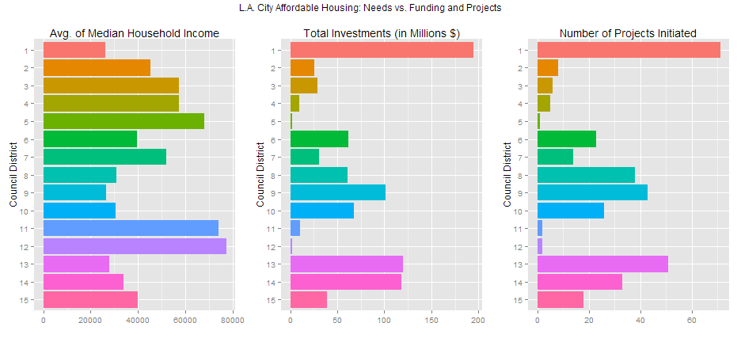
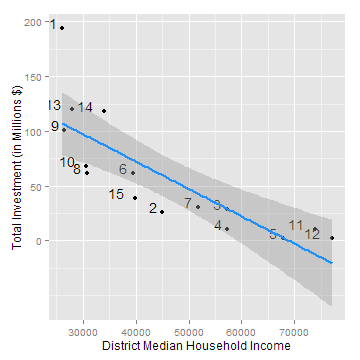
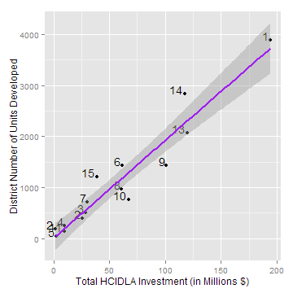
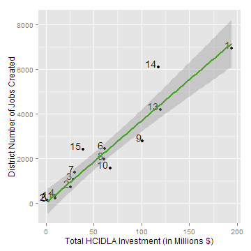

## Los Angeles: Affordable Housing Development Analysis

by [Jude Calvillo](http://linkd.in/1BGeytb)

### Qualifier / Status (as of 11/18/15)
I just started this project, but I hope to have it fully refined by Nov. 30, 2015. In the meantime, I invite you to review it below.

***

### Introduction
This is an analysis of how well L.A. City's Affordable Housing Trust Fund is doing at meeting resident need for affordable housing. In addition to descriptive stats comparing needs to investment, it employs inferential stats and regressions to look for significant differences in investment and productivity. Overall, my goal is to tell a story, based on the evidence, around the Affordable Housing Trust Fund's efficacy. 

Sources:  
* [HCIDLA Affordable Housing Projects Catalog And Listing (2003 To Present) >>](http://bit.ly/1RYxurG)  
* [U.S. Census' American Community Survey: 2006-2013 >>](http://1.usa.gov/1MQDTqS)  

***

### Data Analysis

We'll begin with a few exploratory analyses around need and investment, then up-shift to answering some poignant research questions through inferential statistics and regressions.

#### Exploring

Let's explore some key figures around per-district financial need and the city's Affordable Housing Trust Fund's investments. Below, we'll plot and list each district's median household income (avg), total trust fund investments to date, and total units built or expected to date.


 

*Per-District Values and Descriptions*


| COUNCIL.DISTRICT|DESCRIPTION                    | med_house_income| INVESTMENT| PROJECTS| TOTAL_UNITS|
|----------------:|:------------------------------|----------------:|----------:|--------:|-----------:|
|                1|East/Northeast L.A.            |            26152|  194193529|       71|        3886|
|                2|Southeast San Fernando Valley  |            45043|   25546962|        8|         389|
|                3|Southwest San Fernando Valley  |            57257|   28706467|        6|         509|
|                4|Mid-City/Hollywood Hills areas |            57299|    9988644|        5|         256|
|                5|West L.A., Inland              |            67812|    2400000|        1|          46|
|                6|Central San Fernando Valley    |            39474|   61518197|       23|        1438|
|                7|Northeast San Fernando Valley  |            51737|   30526966|       14|         705|
|                8|South Central L.A.             |            30704|   61149277|       38|         972|
|                9|Southeast L.A.                 |            26472|  101038161|       43|        1436|
|               10|Mid-City/Baldwin Hills area    |            30557|   67590817|       26|         758|
|               11|West L.A., Coastal             |            73937|   10139134|        2|         144|
|               12|Northwest San Fernando Valley  |            77062|    1931627|        2|         183|
|               13|Hollywood area                 |            27977|  119969095|       51|        2069|
|               14|Downtown, East/Northeast L.A.  |            33958|  118016791|       33|        2841|
|               15|Harbor area                    |            39866|   38787487|       18|        1213|

#### Answering Research Questions

The above exploration suggests that the Trust Fund's investments correspond with financial need, generally speaking. However, such a relationship -and its generalizability- have yet to be confirmed. Therefore, let's begin our systematic investigation into needs vs. investments and how productive these investments have been for their local economies.

##### Q1. How well does investment correspond to need in terms of income? (i.e. how well do they correlate?)

As you can see below, over the years, the correlation between median household income per district and trust fund investment per district has been strong, inverse, and highly significant. In other words, the lower a district's median household income is, the more trust fund investment they will receive, although that's not a perfect -1-to-1 relationship.


```
## 
## 	Pearson's product-moment correlation
## 
## data:  d_profiles$INVESTMENT and d_profiles$med_house_income
## t = -4.8564, df = 13, p-value = 0.0003136
## alternative hypothesis: true correlation is not equal to 0
## 95 percent confidence interval:
##  -0.9318851 -0.4937005
## sample estimates:
##        cor 
## -0.8029051
```

##### Q2. How predictive is median household income of total trust investment over the years? Put another way, how well does it explain the variability in investment totals?

The regression between these two shows that median household income actually isn't a very good predictor of total investment, overall, BUT that's probably because of an outlier (District 1). A number of exogenous variables could explain this outlier, such as differences in time of reporting (vs. time of investment), disproportionate housing cost increases, politics, etc.

```
## [1] "Variance explained: 0.645"
```

```
## [1] "Med household income dollars to dollar invested: -2502.389"
```

 

*Please note: I will attempt to compare this model (INVESTMENT ~ MEDIAN HOUSEHOLD INCOME) to other, potentially more predictive, models before I'm finished (11/30/15).*

##### Q3. Moving on to productivity (and project management), how well has number of affordable housing units developed corresponded with HCIDLA dollars invested?

It looks like number of housing units has had a *very strong* correlation with dollars invested, at least at this higher, per district, dimension. *I'll be digger deeper, into the per project dimension shortly.*

```
## 
## 	Pearson's product-moment correlation
## 
## data:  d_profiles$INVESTMENT and d_profiles$TOTAL_UNITS
## t = 12.226, df = 13, p-value = 1.67e-08
## alternative hypothesis: true correlation is not equal to 0
## 95 percent confidence interval:
##  0.8785790 0.9866432
## sample estimates:
##       cor 
## 0.9591594
```

##### Q4. Over the years, how predictive has funding dollar, alone, been of number of units developed? And how many trust fund dollars does it tend to take to develop a single unit?

Below, you'll note that funding dollar is highly predictive of number of units developed, explaining > 92% of the variance in units developed. This also implies that, between districts, developers remain roughly equal in their efficiency, and/or that the HCIDLA Trust Fund is fairly vigilent about enforcing a certain degree of efficiency (below).

*This is also currently at a higher dimension (districts). I may or may not ultimately dig into the lower dimension, for the sake of overall parsimony.*  


```
## [1] "Variance explained: 0.92"
```

```
## [1] "Units per dollar invested: 1.92e-05"
```

 

##### Q5. Over the years, how well has job creation corresponded to HCIDLA dollars funded?


```
## 
## 	Pearson's product-moment correlation
## 
## data:  d_profiles$INVESTMENT and d_profiles$TOTAL_JOBS
## t = 10.967, df = 13, p-value = 6.106e-08
## alternative hypothesis: true correlation is not equal to 0
## 95 percent confidence interval:
##  0.8526370 0.9835878
## sample estimates:
##       cor 
## 0.9499752
```

##### Q6. Over the years, how predictive has HCIDLA funding dollar been of job creation? And how many jobs have been created per HCIDLA funding dollar thus far?


```
## [1] "Variance explained: 0.902"
```

```
## [1] "Jobs per dollar invested: 3.68e-05"
```

 

##### Q9. Have any districts been significantly better -or worse- than the whole of districts for job creation from HCIDLA investments?


```
##    DISTRICT T_SCORE P_VALUE DEGREES     POWER
## 3         3   3.068   0.014   8.860 1.0000000
## 5         5  -2.891   0.004 249.000 0.9819666
## 10       10  -2.438   0.022  26.279 1.0000000
## 12       12  -6.444   0.000  15.507 1.0000000
## 15       15   2.308   0.036  14.907 1.0000000
```

 


### Footnote
Thanks for your time and consideration. I'll be completing this as soon as possible!

Sincerely,  
*Jude C.*


